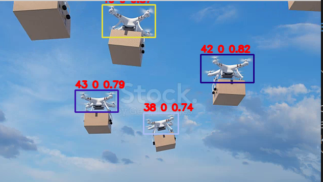

# Introduction
YOLOv5 + ByteTrack/Deepsort on onnxruntime + OpenCV using Realsense D435i

- Model trained on YOLOv5 v6.2 and pytorch v1.11
- onnxruntime 1.11.0
- OpenCV 4.x (tested on v4.6)

# Prerequisites
- OpenCV 4.x
- onnxruntime 1.11.0
- realsense sdk 2.0

# Running Example

## Track video
```bash
./test_track  --model_path ../weights/best_100_epoch.onnx --class_names ../names.txt --source ~/Videos/many_drones.mp4 
```



The numbers upon a box are: the track ID, the label ID and the confidence.

## Track d435i
```
./yolo_track --model_path ../weights/best_100_epoch.onnx --class_names ../names.txt
```

# Build
1. set ```ONNXRUNTIME_DIR``` in ```CMakeLists.txt```
2. build
```bash
cd /path/to/the/project
mkdir build && cd build
cmake -DCMAKE_BUILD_TYPE=Release ..
make -j4
```

# Reference

## DeepSort/ByteTrack
https://github.com/shaoshengsong/DeepSORT

## YOLOv5 + onnxruntime
https://github.com/itsnine/yolov5-onnxruntime

## OpenCV wrapper for realsense
https://github.com/IntelRealSense/librealsense/tree/master/wrappers/opencv

## UAV image dataset
https://www.kaggle.com/datasets/dasmehdixtr/drone-dataset-uav

## Other datasets
...
